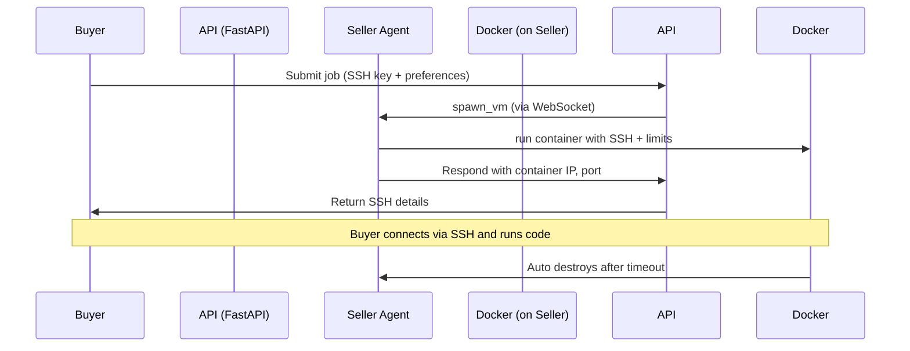

# 🧠 Compute Marketplace

A decentralized platform where **buyers** request computational resources, and **sellers** offer their machines as secure, containerized compute environments accessible over **SSH**. Think of it as turning any machine into a lightweight **EC2 alternative**.

---

## 📦 Features

* 🔌 **Real-time matchmaking** between buyers and online sellers
* 🐳 **SSH-enabled Docker containers** acting as disposable VMs
* 📡 **WebSocket-based seller heartbeat + communication**
* 🔐 **SSH key-based access** for buyers
* ⏳ **Auto-destruction** of VMs after timeout
* 🧾 **Job tracking** in a PostgreSQL database (status, history)
* 🚫 **No Celery** – moved to on-demand container creation

---

## ⚙️ System Overview



---

## 🛠️ Tech Stack

| Component     | Tech                           |
| ------------- | ------------------------------ |
| API Server    | FastAPI + SQLAlchemy (async)   |
| Database      | PostgreSQL                     |
| Real-time     | WebSocket (Starlette)          |
| Compute Unit  | Docker container (SSH-enabled) |
| Orchestration | Docker Compose                 |

---

## 🧪 API Endpoints

### `POST /jobs/submit`

Submit a new job.

```json
{
  "ssh_pubkey": "ssh-rsa AAAAB3NzaC1yc2EAAAADAQABAAABAQC...",
  "preferred_image": "ubuntu:ssh-enabled",
  "cpu_quota": 50000,
  "mem_limit": "512m"
}
```

Returns:

```json
{
  "job_id": "uuid",
  "seller_ip": "192.168.x.x",
  "ssh_port": 2222,
  "ssh_user": "root"
}
```

---

### `GET /sellers/online`

Returns a list of currently connected sellers.

---

## 🧑‍💻 Seller Setup

Run the seller agent on your own machine:

```bash
python seller_agent.py --id my-machine-id
```

This will:

* Connect to the central API via WebSocket
* Listen for job requests
* Spawn Docker containers with SSH access
* Auto-destroy containers after timeout

---

## 🧰 Docker Compose

```bash
docker-compose up --build
```

Runs:

* `api`: FastAPI app with WebSocket + REST
* `postgres`: stores jobs & metadata

---

## 🔐 Security Considerations

* Only whitelisted Docker images are allowed
* Resource limits enforced (CPU, RAM)
* SSH only via provided public key
* VM (container) auto-destroyed after 10 min

---

## 🧭 Future Roadmap

* [ ] Add real VMs using Firecracker or QEMU
* [ ] Buyer authentication (JWT/session)
* [ ] Billing based on usage (time/resources)
* [ ] Prometheus metrics + dashboards
* [ ] Rate-limiting & abuse protection

---

## 🤝 Contributing

1. Fork the repo
2. Add your seller machine
3. Test real-time container provisioning
4. Submit PRs for new provider types (e.g., Firecracker)

---
